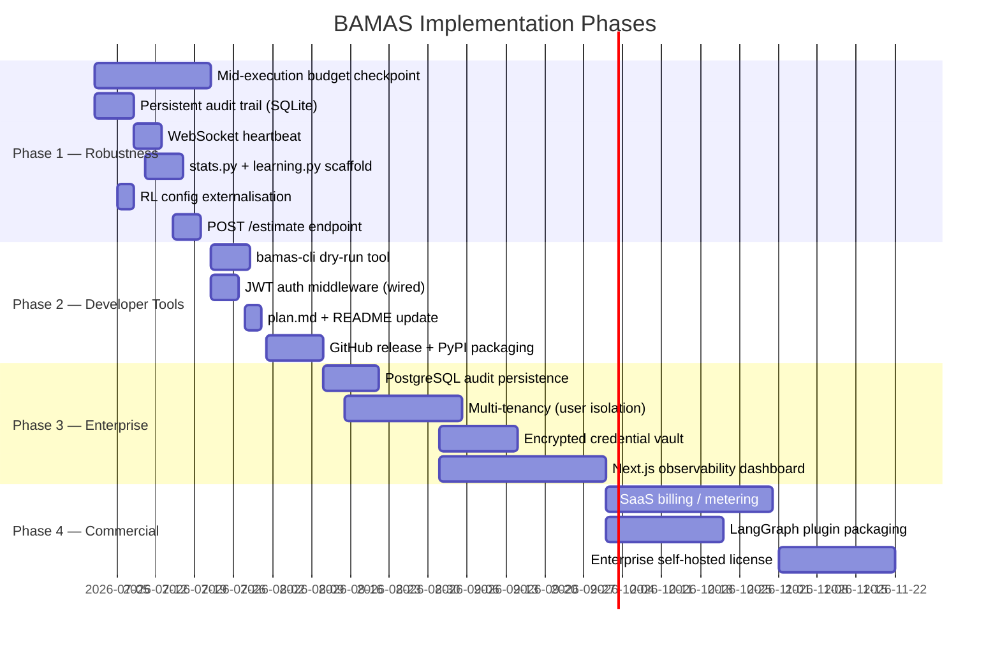

# BAMAS — Implementation Guide
> *Novelty analysis, codebase improvement suggestions, and phased build roadmap*

---

## Table of Contents

1. [Why BAMAS Is Genuinely Novel](#1-why-bamas-is-genuinely-novel)
2. [Competitive Landscape (Web Research)](#2-competitive-landscape-web-research)
3. [Critical Gaps: plan.md vs. Current Code](#3-critical-gaps-planmd-vs-current-code)
4. [Suggested Changes to plan.md](#4-suggested-changes-to-planmd)
5. [Suggested Changes to commercialization_roadmap.md](#5-suggested-changes-to-commercialization_roadmapmd)
6. [Concrete Code Improvements](#6-concrete-code-improvements)
7. [Phased Implementation Roadmap](#7-phased-implementation-roadmap)
8. [Future Research Directions](#8-future-research-directions)

---

## 1. Why BAMAS Is Genuinely Novel

### 1.1 What No Other System Does

BAMAS combines **three mechanisms** that individually exist elsewhere but are never combined into one unified runtime:

| Mechanism | BAMAS | Competitors |
|---|---|---|
| LLM-guided topology selection (semantic) | ✅ Primary path | ❌ None |
| Contextual Multi-Armed Bandit (Thompson Sampling) per topology arm | ✅ RL refinement | Partial (TREACLE uses RL for model cascade only) |
| Pre-execution topology **structural degradation** under budget pressure | ✅ Novel ★ | ❌ None — all others swap models, not topology shape |
| Reasoning-divergence escalation (not vote count) | ✅ Novel ★ | ❌ None |
| 4-band budget governor with automatic downgrade chain | ✅ Novel ★ | ❌ None |

The **topology degradation chain** (`ensemble→fanout→supervisor→pipeline→single`) is the single most unique engineering contribution. No published framework does pre-run structural graph collapse as a budget response. LangSight, AgentPrune, and BudgetMLAgent all stop at model-tier swapping.

### 1.2 What BAMAS Adapts from the AAAI-26 Paper

The original BAMAS paper (Yang et al., 2026, AAAI-40) uses **Integer Linear Programming (ILP)** for model selection. This implementation **replaces ILP with LLM semantic classification** as the primary optimizer, keeping RL (Thompson Sampling) for topology refinement. This is a valid and practical departure because:

- ILP requires offline profiling of model performance per task type — expensive to maintain.
- LLM classification is zero-shot generalisable, costs ~1 LLM call, and falls back to rules.
- The RL layer provides the adaptive optimisation the paper intended ILP to give.

**This deviation should be documented as a conscious design decision**, not an omission.

### 1.3 What the Market Is Saying (2026 Data)

- AI agent software spend hits **$206.5 billion in 2026** (Gartner, May 2026) — up 139% YoY.
- The AI agents market grows from **$7.6B (2025) → $182.9B (2033)** at 49.6% CAGR (Grand View Research).
- **Production cost blowouts are the #1 pain point** — one team's prototype costing $20/month hit $9,800 in month two (Edgeless Lab, 2026). This is BAMAS's exact wedge.
- Only 14–23% of enterprises have reached production-scale agent deployment. The market needs cost governance tooling *now* to unlock the remaining 77–86%.
- LangGraph's durable execution (checkpoints, retries, fan-out) **amplifies cost failures** — this is documented at runcycles.io (March 2026), which directly validates BAMAS's approach.

---

## 2. Competitive Landscape (Web Research)

### 2.1 Direct Competitors

| System | Cost Strategy | Topology Selection | Runtime Budget Enforcement |
|---|---|---|---|
| **BAMAS (this repo)** | LLM + RL + topology degradation | 5 topologies, RL-selected | 4-band governor, pre-execution |
| AgentBalance (HKUST, 2025) | Backbone-then-topology, latency-aware | Adaptive topology synthesis | At design time only |
| BudgetMLAgent (TCS, 2024) | LLM cascade + profiling + expert calls | Fixed (cascade) | None |
| TREACLE (NeurIPS 2024) | RL for model + prompt selection | No topology concept | Per-query budget |
| AgentPrune (2024) | Communication graph pruning | Fixed topology, prunes messages | None |
| LangSight (2026) | Budget cap via monkey-patch | None | Per-session cap (hard stop) |
| AgentOps Control Plane | Cost attribution + quality scoring | None | None |

### 2.2 White Space BAMAS Owns

1. **Mid-execution budget enforcement with topology degradation** — nobody does this in real time.
2. **Reasoning-divergence as an escalation signal** — all others use vote-count or static thresholds.
3. **Multi-topology orchestrator as a drop-in middleware** — not just a proxy or a wrapper.
4. **RL policy that learns which topology works for which task type** — persistent, improves over time.

### 2.3 Risks to Novelty

- **AgentBalance** (Dec 2025) is the closest academic competitor. It does backbone-then-topology selection but lacks runtime budget governance.
- **LangGraph Platform** (LangChain Inc.) is building managed deployment with cost controls — potential to commoditise the proxy layer. BAMAS must differentiate at the topology-intelligence and RL layers.
- **OpenAI Realtime API** and native model routing (GPT-4o mini fallback) reduce the need for external orchestration at the cheap/standard tier boundary.

---

## 3. Critical Gaps: plan.md vs. Current Code

These are inconsistencies or gaps found by cross-referencing `docs/plan.md`, `feature_comparison.md`, and the actual source files.

### 3.1 RL Cold-Start Threshold Mismatch

`docs/plan.md` says:
> *"Only overrides after ≥10 trained tasks."* (Section: RL Policy Details)

`core/rl_policy.py` initialises from the plan description with a threshold of 5 for selection and uses separate logic for overriding. The documentation is inconsistent. **Fix**: make `RL_MIN_TASKS_FOR_OVERRIDE` a configurable setting in `core/config.py` and document the actual value.

### 3.2 Pre-Execution Only — Not Mid-Execution

`docs/plan.md` correctly notes:
> *"Degradation happens pre-execution (before graph invocation), not mid-execution."*

But `commercialization_roadmap.md` lists **mid-execution checkpointing** as a needed feature, and it is marked `Missing` in `feature_comparison.md`. This is the single highest-value engineering gap. The fix is described in Section 6.1 below.

### 3.3 stats.py and learning.py (V3) Are Mentioned but Missing

`docs/file-spec.md` describes two V3 modules:
- `core/stats.py` — tracks topology × budget × task performance.
- `core/learning.py` — self-optimisation loop using Judge scores.

Neither file exists. The RL policy (`core/rl_policy.py`) partially covers `stats.py` functionality but lacks the Judge-score feedback loop. These should be scaffolded now, even if empty, so the architecture is complete.

### 3.4 JWT Config Present, Not Integrated

`feature_comparison.md` notes: *"JWT secret in config — Implemented. OAuth2/JWT authentication — Missing."*

`core/config.py` has a `JWT_SECRET` setting that is never used in `api/`. The field should either be wired up or removed to avoid confusion.

### 3.5 WebSocket Heartbeat Missing

The WebSocket at `/ws/{task_id}` subscribes to Redis pub/sub and streams events. There is no heartbeat/ping mechanism. Long-running tasks (>30s) will silently disconnect on most reverse proxies (nginx default: 60s idle timeout). This needs a periodic `ping` frame.

### 3.6 Audit Trail in Memory Only

`core/audit.py` is an in-memory singleton. On process restart all audit data is lost. For any commercial use, audit must be persisted (SQLite as a minimum, PostgreSQL for production).

---

## 4. Suggested Changes to plan.md

These are additions/corrections to `docs/plan.md`:

### 4.1 Add ILP → LLM Replacement Note

Add a section after **Cost-tier Optimizer — Flow**:

```
### Design Departure from AAAI-26 Paper
The original BAMAS paper uses Integer Linear Programming (ILP) for model selection.
This implementation replaces ILP with LLM semantic classification as the primary
optimizer. Rationale: ILP requires per-model performance profiling per task type,
which is expensive to maintain in production. LLM classification is zero-shot
generalizable and falls back gracefully to rules. The RL layer provides the adaptive
optimization the ILP was intended to supply.
```

### 4.2 Update RL Cold-Start Threshold

Change the RL Policy Details section to:

```
- **Cold start**: Returns None for first {RL_MIN_TASKS_FOR_SELECTION} tasks (configurable, default 5)
- **Override threshold**: Only overrides LLM decision after ≥{RL_MIN_TASKS_FOR_OVERRIDE} trained tasks (configurable, default 10)
```

### 4.3 Add Mid-Execution Checkpointing to Layer 5

Update the **Budget Governor ★** section to include a planned mid-execution mode:

```
| Spent | Band | Action |
|-------|------|--------|
| <70% | HEALTHY | Full topology, all tiers |
| 70-90% | TIER_DOWNGRADE | Downgrade model tiers only |
| 90-100% | STRUCTURAL_DEGRADE | Collapse topology pre-execution (current); pause and migrate mid-execution (planned) |
| >100% | CRITICAL | Single topology, cheap model, skip Judge |
```

### 4.4 Add stats.py and learning.py to Directory Structure

```
├── core/
│   ├── ...
│   ├── stats.py            # (V2) topology × budget × task performance tracker
│   └── learning.py         # (V2) Judge-score feedback loop → optimizer improvement
```

### 4.5 Add Related Work Section

```
## Related Work
| System | Paper | Key Difference |
|--------|-------|----------------|
| AgentBalance | arXiv 2512.11426, 2025 | Backbone-then-topology; no runtime budget enforcement |
| BudgetMLAgent | TCS Research, 2024 | LLM cascade; no topology abstraction |
| TREACLE | NeurIPS 2024 | RL model+prompt selection; no multi-topology orchestration |
| AgentPrune | arXiv 2410.02506 | Message pruning; no budget degradation |
```

---

## 5. Suggested Changes to commercialization_roadmap.md

### 5.1 Add Market Size Data (Strengthens the Case)

Insert before Section 1:

```
## Market Context (2026)
- AI agent software spend: $206.5B in 2026, up 139% YoY (Gartner)
- AI agents market: $7.6B (2025) → $182.9B by 2033 at 49.6% CAGR (Grand View Research)
- Production cost blowouts are the #1 documented pain point: prototype→production
  cost spikes of 5–15× are reported across the industry (Edgeless Lab, 2026)
- LangGraph's durable execution (retries, fan-out, checkpoints) amplifies cost
  failures — documented at runcycles.io (March 2026). BAMAS's budget governor
  directly addresses this pattern.
```

### 5.2 Reframe the Agentic Guardrail as a "Cost Control Layer"

The tagline *"We guarantee your AI agents will never exceed their budget"* is strong but slightly overpromises (CRITICAL band still runs a degraded single agent). A more defensible framing:

> *"BAMAS is the cost-intelligence layer for production multi-agent systems: it automatically selects the cheapest topology that meets your quality threshold, and degrades gracefully before budget overruns occur."*

### 5.3 Reprioritise GTM — CLI Tool to Step 1

The CLI tool (`bamas-cli`) is listed as Step 2 in GTM. It should be Step 1 because:
- It is a zero-infrastructure lead magnet.
- It produces shareable artefacts (Budget Burn Risk Reports) that go viral in dev communities.
- It makes the core algorithm discoverable before the full backend is needed.

### 5.4 Add a 4th Business Model: "Agentic Policy SDK"

```
| 4. Policy SDK for LangGraph | Package the budget governor + escalation engine as
  `pip install bamas-policy`. Developers add it as a governance node inside any
  LangGraph workflow. | LangGraph / LangChain ecosystem developers |
  Open-core: free for <$100/mo API spend per tenant, $49/mo commercial license above.
```

### 5.5 Add the Academic Citation as Social Proof

The AAAI-26 paper citation should appear prominently in the README and commercialization doc:

> *"Based on the peer-reviewed AAAI-26 paper: Yang, L. et al. (2026). BAMAS: Structuring Budget-Aware Multi-Agent Systems. AAAI-40, pp. 29802–29810."*

This is a rare and strong differentiator — most competing repos have no peer-reviewed backing.

---

## 6. Concrete Code Improvements

### 6.1 Mid-Execution Budget Enforcement (Highest Priority)

**Current state**: `core/degrader.py` degrades topology *before* `compile_graph()` is called.
**Needed**: A graph interrupt that checks the budget after each node completes and re-routes if a budget band is crossed mid-execution.

**Implementation sketch** (`core/budget_interrupt.py`):

```python
"""
Mid-execution budget checkpoint injected as a LangGraph node.
Placed after each major node (Executor, Validator) in the graph.
"""
from core.budget import BudgetTracker, BudgetBand
from core.degrader import degrade_topology
from core.events import EventBroadcaster
from agent.state import AgentState

async def budget_checkpoint(state: AgentState) -> dict:
    """
    Checks the current budget band after each node.
    If the band has worsened since the last check, emits a degradation event
    and updates the state's effective topology for remaining steps.
    """
    tracker: BudgetTracker = state["budget_tracker"]
    current_band = tracker.get_band()
    previous_band = state.get("last_budget_band", BudgetBand.HEALTHY)

    if current_band.value > previous_band.value:
        # Band has worsened — degrade the remaining topology
        new_topology = degrade_topology(tracker, state["topology"])
        await EventBroadcaster.emit(state["task_id"], "budget_degradation", {
            "from_band": previous_band.name,
            "to_band": current_band.name,
            "from_topology": state["topology"],
            "to_topology": new_topology,
        })
        return {
            "topology": new_topology,
            "last_budget_band": current_band,
        }

    return {"last_budget_band": current_band}
```

Wire into `agent/topologies/builder.py`:

```python
# In compile_graph(), after adding executor node:
graph.add_node("budget_checkpoint", budget_checkpoint)
graph.add_edge("executor", "budget_checkpoint")
graph.add_edge("budget_checkpoint", "validator")
```

This requires adding `last_budget_band` and `budget_tracker` to `AgentState`.

---

### 6.2 Persistent Audit Trail (core/audit.py)

Replace the in-memory singleton with SQLite (zero-dependency, already in `requirements.txt` via `aiosqlite`):

```python
# core/audit.py — replace AuditTrail singleton with async SQLite persistence

import aiosqlite
from datetime import datetime
from pathlib import Path

DB_PATH = Path("./workspace/audit.db")

async def init_audit_db():
    async with aiosqlite.connect(DB_PATH) as db:
        await db.execute("""
            CREATE TABLE IF NOT EXISTS audit_events (
                id INTEGER PRIMARY KEY AUTOINCREMENT,
                task_id TEXT NOT NULL,
                event_type TEXT NOT NULL,
                payload TEXT NOT NULL,
                timestamp TEXT NOT NULL
            )
        """)
        await db.execute("CREATE INDEX IF NOT EXISTS idx_task_id ON audit_events(task_id)")
        await db.commit()

async def record_event(task_id: str, event_type: str, payload: dict):
    import orjson
    async with aiosqlite.connect(DB_PATH) as db:
        await db.execute(
            "INSERT INTO audit_events (task_id, event_type, payload, timestamp) VALUES (?, ?, ?, ?)",
            (task_id, event_type, orjson.dumps(payload).decode(), datetime.utcnow().isoformat())
        )
        await db.commit()

async def get_audit_trail(task_id: str) -> list[dict]:
    import orjson
    async with aiosqlite.connect(DB_PATH) as db:
        async with db.execute(
            "SELECT event_type, payload, timestamp FROM audit_events WHERE task_id = ? ORDER BY id",
            (task_id,)
        ) as cursor:
            rows = await cursor.fetchall()
            return [{"event_type": r[0], "payload": orjson.loads(r[1]), "timestamp": r[2]} for r in rows]
```

Call `await init_audit_db()` in the FastAPI lifespan function (`api/main.py`).

---

### 6.3 WebSocket Heartbeat (api/websocket.py)

```python
import asyncio
from fastapi import WebSocket

async def websocket_endpoint(websocket: WebSocket, task_id: str):
    await websocket.accept()
    
    async def heartbeat():
        while True:
            await asyncio.sleep(20)
            try:
                await websocket.send_json({"type": "ping"})
            except Exception:
                break
    
    heartbeat_task = asyncio.create_task(heartbeat())
    try:
        # ... existing Redis pub/sub subscription logic ...
        pass
    finally:
        heartbeat_task.cancel()
        await websocket.close()
```

---

### 6.4 Scaffold stats.py and learning.py (core/)

**`core/stats.py`** — Tracks topology × budget × task performance for the RL reward signal:

```python
"""
Tracks task outcomes by topology, budget band, and task type.
Feeds the RL policy's reward function with richer historical data.
"""
from dataclasses import dataclass, field
from collections import defaultdict
from statistics import mean

@dataclass
class TaskOutcome:
    topology: str
    budget_band: str
    task_type: str  # code / research / data / verify / general
    quality_score: float  # 0.0–1.0 from Judge or Validator
    cost_usd: float
    cost_efficiency: float  # budget_remaining / budget_total

class PerformanceStats:
    """In-memory (V1) performance stats. Persisted to Redis in V2."""
    
    def __init__(self):
        self._outcomes: list[TaskOutcome] = []
        self._by_topology: dict[str, list[TaskOutcome]] = defaultdict(list)
    
    def record(self, outcome: TaskOutcome):
        self._outcomes.append(outcome)
        self._by_topology[outcome.topology].append(outcome)
    
    def best_topology_for(self, task_type: str, budget_band: str) -> str | None:
        """Returns the topology with highest mean quality for a given context."""
        candidates = {
            topo: [o.quality_score for o in outcomes
                   if o.task_type == task_type and o.budget_band == budget_band]
            for topo, outcomes in self._by_topology.items()
        }
        scored = {t: mean(scores) for t, scores in candidates.items() if len(scores) >= 3}
        return max(scored, key=scored.get) if scored else None

stats = PerformanceStats()
```

**`core/learning.py`** — Closes the feedback loop between Judge output and the optimizer:

```python
"""
Self-optimisation loop. Judge scores (quality_score) are fed back into
both the RL policy reward and the performance stats tracker.
"""
from core.stats import stats, TaskOutcome
from core.rl_policy import RLPolicy

async def record_task_result(
    rl_policy: RLPolicy,
    topology: str,
    budget_band: str,
    task_type: str,
    quality_score: float,
    cost_usd: float,
    budget_total: float,
):
    """
    Called at task completion (in agent/graph.py after finalizer).
    Updates both the RL policy and the performance stats tracker.
    """
    cost_efficiency = max(0.0, 1.0 - (cost_usd / budget_total)) if budget_total > 0 else 0.0
    reward = quality_score * 0.7 + cost_efficiency * 0.3

    # Update RL policy
    arm_index = rl_policy.topology_to_arm(topology)
    if arm_index is not None:
        rl_policy.update(arm_index, reward)

    # Update stats tracker
    stats.record(TaskOutcome(
        topology=topology,
        budget_band=budget_band,
        task_type=task_type,
        quality_score=quality_score,
        cost_usd=cost_usd,
        cost_efficiency=cost_efficiency,
    ))
```

---

### 6.5 Make RL Thresholds Configurable (core/config.py)

Add to `Settings`:

```python
# RL Policy tuning
RL_MIN_TASKS_FOR_SELECTION: int = 5    # Tasks before RL starts suggesting
RL_MIN_TASKS_FOR_OVERRIDE: int = 10   # Tasks before RL can override LLM decision
RL_QUALITY_WEIGHT: float = 0.7        # Weight of quality score in reward
RL_COST_EFFICIENCY_WEIGHT: float = 0.3  # Weight of cost efficiency in reward
```

---

### 6.6 JWT Authentication (Minimal, Wire It Up)

`core/config.py` already has `JWT_SECRET`. Wire it into a simple API key middleware:

```python
# api/middleware/auth.py
from fastapi import HTTPException, Security, status
from fastapi.security import HTTPBearer, HTTPAuthorizationCredentials
import jwt

security = HTTPBearer(auto_error=False)

async def verify_token(credentials: HTTPAuthorizationCredentials = Security(security)):
    from core.config import settings
    if not settings.JWT_SECRET:
        return  # Auth disabled in development
    if not credentials:
        raise HTTPException(status_code=status.HTTP_401_UNAUTHORIZED, detail="Missing token")
    try:
        jwt.decode(credentials.credentials, settings.JWT_SECRET, algorithms=["HS256"])
    except jwt.PyJWTError:
        raise HTTPException(status_code=status.HTTP_401_UNAUTHORIZED, detail="Invalid token")
```

Add to `api/routes/execute.py`:

```python
from api.middleware.auth import verify_token

@router.post("/execute", dependencies=[Depends(verify_token)])
async def execute_task(...):
    ...
```

Add `PyJWT` to `requirements.txt`.

---

### 6.7 Dry-Run / Cost Estimation Endpoint

Add `POST /estimate` that runs only the optimizer (no graph execution) and returns a cost estimate:

```python
# api/routes/estimate.py
@router.post("/estimate")
async def estimate_task(request: ExecuteRequest):
    decision = await optimizer.optimize(request.task, request.budget_usd, request.topology)
    estimated_cost = _estimate_cost(decision.topology, decision.model_tiers)
    return {
        "topology": decision.topology,
        "model_tiers": decision.model_tiers,
        "rationale": decision.rationale,
        "estimated_cost_usd": estimated_cost,
        "budget_usd": request.budget_usd,
        "budget_headroom_pct": max(0, 100 * (1 - estimated_cost / request.budget_usd)),
    }
```

This powers the CLI tool and is a critical developer UX feature.

---

### 6.8 bamas-cli Scaffold

Create `cli/bamas_cli.py`:

```python
#!/usr/bin/env python3
"""
bamas-cli — Budget Burn Risk Analyser for LangGraph agents.
Usage: python -m cli.bamas_cli --task "..." --budget 1.00
"""
import argparse
import asyncio
import httpx

async def dry_run(task: str, budget: float, server: str = "http://localhost:8000"):
    async with httpx.AsyncClient() as client:
        resp = await client.post(f"{server}/estimate", json={"task": task, "budget_usd": budget})
        data = resp.json()
    
    print("\n=== BAMAS Budget Burn Risk Report ===")
    print(f"  Task         : {task[:80]}")
    print(f"  Budget       : ${budget:.2f}")
    print(f"  Topology     : {data['topology']}")
    print(f"  Model tiers  : {data['model_tiers']}")
    print(f"  Est. cost    : ${data['estimated_cost_usd']:.4f}")
    print(f"  Budget left  : {data['budget_headroom_pct']:.1f}%")
    print(f"  Rationale    : {data['rationale']}")
    
    risk = "LOW" if data["budget_headroom_pct"] > 30 else "MEDIUM" if data["budget_headroom_pct"] > 10 else "HIGH"
    print(f"\n  Risk Level   : {risk}")
    print("=====================================\n")

if __name__ == "__main__":
    parser = argparse.ArgumentParser(description="BAMAS Budget Burn Risk Analyser")
    parser.add_argument("--task", required=True, help="Task description")
    parser.add_argument("--budget", type=float, required=True, help="Budget in USD")
    parser.add_argument("--server", default="http://localhost:8000", help="BAMAS server URL")
    args = parser.parse_args()
    asyncio.run(dry_run(args.task, args.budget, args.server))
```

---

## 7. Phased Implementation Roadmap



### Phase 1 — Robustness (Weeks 1–4)

**Goal**: Make the existing system production-safe with zero external dependencies added.

| Task | File(s) | Effort | Impact |
|---|---|---|---|
| Mid-execution budget checkpoint | `core/budget_interrupt.py`, `agent/topologies/builder.py`, `agent/state.py` | 3d | ★★★★★ |
| Persistent audit trail (SQLite) | `core/audit.py` | 1d | ★★★★ |
| WebSocket heartbeat | `api/websocket.py` | 0.5d | ★★★ |
| Scaffold stats.py + learning.py | `core/stats.py`, `core/learning.py` | 1d | ★★★ |
| RL config externalisation | `core/config.py`, `core/rl_policy.py` | 0.5d | ★★ |
| POST /estimate endpoint | `api/routes/estimate.py`, `api/main.py` | 1d | ★★★★ |

### Phase 2 — Developer Tools (Weeks 5–7)

**Goal**: Create lead magnets and make the system installable.

| Task | File(s) | Effort | Impact |
|---|---|---|---|
| `bamas-cli` dry-run tool | `cli/bamas_cli.py`, `pyproject.toml` | 1.5d | ★★★★★ |
| Wire JWT auth | `api/middleware/auth.py`, `api/routes/*.py` | 1d | ★★★ |
| Plan.md + README improvements | `docs/plan.md`, `README.md` | 1d | ★★★ |
| PyPI packaging (`pip install bamas`) | `pyproject.toml`, `MANIFEST.in` | 2d | ★★★★ |

### Phase 3 — Enterprise (Weeks 8–14)

**Goal**: Add the infrastructure needed for paying enterprise customers.

| Task | Depends On | Effort |
|---|---|---|
| PostgreSQL audit persistence | Phase 1 audit work | 2d |
| Multi-tenancy (org/user isolation in Redis + audit) | JWT from Phase 2 | 5d |
| Encrypted credential vault (per-user API keys) | Multi-tenancy | 3d |
| Next.js observability dashboard | POST /estimate + WebSocket | 2–4 weeks |

### Phase 4 — Commercial (Weeks 15+)

**Goal**: Monetise.

| Task | Description |
|---|---|
| Billing/metering infrastructure | Stripe integration for pay-as-you-go proxied spend |
| LangGraph plugin | `pip install bamas-policy` governance node |
| Enterprise self-hosted license | Docker image + license key enforcement |
| Technical blog post | Medium/HN deep dive referencing AAAI-26 paper |

---

## 8. Future Research Directions

### 8.1 Online ILP (Restore Paper Fidelity)

The original AAAI-26 paper uses ILP for model selection. Implement a lightweight online ILP solver using `scipy.optimize.milp` (already in `requirements.txt` as `scipy`) that uses **observed cost-per-token data** from `core/stats.py` as ILP coefficients. This would make BAMAS fully paper-faithful and publishable as an extension.

### 8.2 Cross-Task RL Transfer

Current Thompson Sampling resets per deployment. Add **task embedding similarity**: when a new task arrives, find the 3 most similar past tasks (cosine similarity of task embeddings stored in Redis), and initialise the Thompson Sampling priors from their outcomes. This is a direct research contribution.

### 8.3 Topology-Aware Escalation

`docs/plan.md` notes:
> *"Current implementation is threshold-based. Not topology-aware."*

For supervisor topology, the escalation check should compare divergence between *worker sub-results*, not just executor vs. validator. This requires routing divergence signals through the supervisor dispatch loop.

### 8.4 Adversarial Budget Injection Resistance

As documented in AgentPrune (2024), multi-agent systems are vulnerable to adversarial messages inflating token counts. BAMAS's budget governor could be extended with a **token-budget pre-commitment** step: estimate max tokens per step from the plan, reject execution if a step would exceed its allocation.

### 8.5 Benchmark on SWE-Bench / GAIA

The AAAI-26 paper evaluates on 3 internal tasks. A public evaluation on **SWE-Bench** (code), **GAIA** (general), and **HumanEval** (code generation) would make BAMAS's cost savings claims independently verifiable and dramatically increase academic citations and GitHub visibility.

---

## Summary: Top 5 Actions Right Now

| # | Action | File | Impact | Time |
|---|---|---|---|---|
| 1 | Build mid-execution budget checkpoint | `core/budget_interrupt.py` | Closes the biggest technical gap vs. the paper | 3d |
| 2 | Add `POST /estimate` endpoint | `api/routes/estimate.py` | Enables CLI + developer self-service | 1d |
| 3 | Scaffold `stats.py` + `learning.py` | `core/` | Completes the architecture promised in file-spec.md | 1d |
| 4 | Make RL thresholds configurable | `core/config.py`, `core/rl_policy.py` | Fixes plan.md inconsistency, enables tuning | 0.5d |
| 5 | Wire JWT auth | `api/middleware/auth.py` | Unblocks multi-tenancy, removes dead config | 1d |

---

*Generated: 2026-07-01 | Based on AAAI-26 paper + repo analysis + web research*
