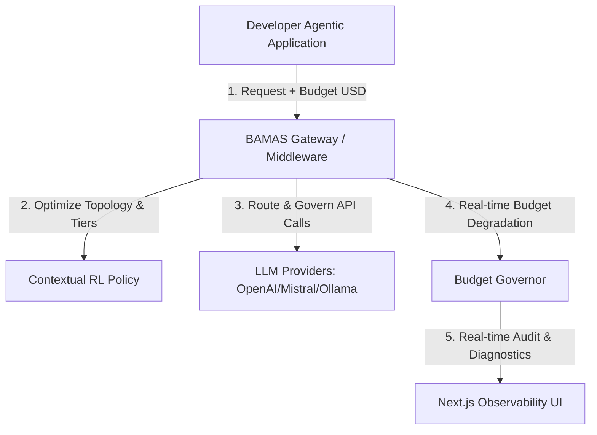

# Commercialization & Technical Roadmap: Scaling BAMAS to Market

To transform this academic implementation of a budget-aware multi-agent system into a commercial product that developers and enterprises will pay for, you must pivot the project from a **"standalone demo backend"** to a **"Developer Middleware & Observability Platform for Cost-Controlled AI Agents."**

Below is the strategic blueprint.

---

## 1. The Core Value Proposition: The "Agentic Guardrail"
In production, multi-agent systems (e.g., CrewAI, LangGraph, custom loops) are notorious for **runaway token consumption** and **unpredictable billing**. A single looping bug can burn hundreds of dollars in minutes. 

BAMAS solves this by acting as an **Agentic Guardrail**:
> *"We guarantee your AI agents will never exceed their budget, while automatically maximizing accuracy using contextual Reinforcement Learning."*

---

## 2. Recommended Technical Enhancements (To Make It "Enterprise-Ready")

To make this repository saleable, you need to transition from mockup utilities to production-grade infrastructure:

### A. State Hydration & Mid-Execution Pausing
* **Current Limitation**: The budget degradation collapses the topology *before* graph execution based on pre-run budget checks.
* **Feature Needed**: **Mid-execution checkpointing**. If a task is running a complex ensemble topology and the budget crosses the $90\%$ threshold, the system must **pause the graph state, serialize it, migrate the remaining steps to a cheap model/single topology, and hydrate the execution** without wasting tokens on restarting from step 1.
* **Stack**: LangGraph checkpoint savers backed by **PostgreSQL** or **Redis Enterprise**.

### B. SaaS Multi-Tenancy & Vault Integration
* **Feature Needed**: Developers need to configure their own LLM API keys. You must implement a secure credentials vault (e.g., **HashiCorp Vault** or encrypted database fields) so users can link their OpenAI/Mistral keys safely.
* **Authentication**: Integrate **OAuth2 / JWT** with providers like Clerk or Auth0.

### C. A High-Fidelity Observability Dashboard
* **Current Limitation**: The frontend is a basic vanilla JS index page.
* **Feature Needed**: A modern Next.js/Tailwind React dashboard showing:
    * **Real-time token burn charts** (using Recharts or Tremor).
    * **Visual Graph Playback**: Highlight which topology node is executing and show live budget bands changing in real-time.
    * **RL Convergence Audits**: Visualizations showing how Thompson Sampling is learning and choosing topologies for different tasks over time.

---

## 3. Commercialization & Business Models

| Monetization Model | Description | Target Audience | Pricing Structure |
| :--- | :--- | :--- | :--- |
| **1. Developer SaaS Gateway** | A hosted API proxy. Developers change their `base_url` to BAMAS. We manage the budget, tracking, and degradation automatically. | Startup teams, Indie Hackers | **Pay-as-you-go**: Free tier up to $10/mo of proxied spend, then $0.05 per $1.00 of API savings generated. |
| **2. Open-Core / Self-Hosted** | Open-source core engine with a commercial license for self-hosted enterprise setups. | Enterprise, Healthcare, Finance (who cannot expose keys or data to third-party SaaS). | **Tiered Subscription**: $99/mo to $999/mo based on active worker nodes and SSO support. |
| **3. LangChain/LangGraph Plugin** | Package the cost optimizer and budget degrader as an official library/plugin. | LangChain Ecosystem Developers | **Licensing Fee**: One-time purchase per developer seat, or support contracts. |

---

## 4. Go-To-Market (GTM) Strategy: How to Sell It

### Step 1: Open-Source Launch (Showcase Academic Novelty)
* **Write a Technical Blog Post**: Write a deep dive on Medium, Dev.to, or Hacker News titled: *"Implementing AAAI-26 BAMAS: How I Built a Contextual MAB Budget Governor for LangGraph."*
* **GitHub Marketing**: Refactor the README to focus on developer integration (e.g., `"import bamas"`). Submit to GitHub Trending and AI newsletters (like TLDR, Ben's Bytes).

### Step 2: Build a Free CLI Tool
* Create a lightweight CLI tool (`bamas-cli`) that lets developers dry-run their agent scripts and outputs a **"Budget Burn Risk Report"** indicating potential runaway loop points. This acts as a lead magnet.

### Step 3: Targeted Outbound to AI Startups
* Target startups on Y-Combinator or ProductHunt who are building AI agents. Pitch them the cost reduction metric: **"Reduce your OpenAI billing by 60% without dropping task validation accuracy."** Offer them a free 30-day proof of concept (PoC) of the BAMAS middleware.
