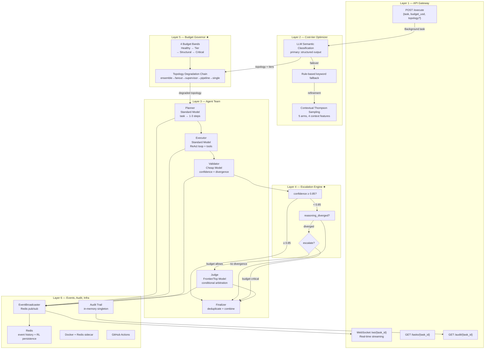
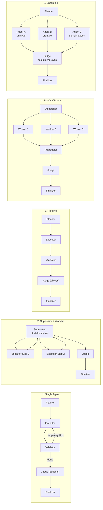

# BAMAS — Architecture Plan (Synced to Code)

## What We're Building
A **budget-aware multi-agent system** that accepts a plain-English task + budget via API, uses a cost-tier optimizer (LLM semantic classifier + rule-based fallback + contextual Thompson Sampling RL) to select topology and model tiers, then orchestrates four specialized agents (Planner, Executor, Validator, Judge) with a reasoning-divergence escalation engine and a budget governor that degrades topology pre-execution when cost is low. Deployed via FastAPI + Docker + GitHub Actions.

## Where Differentiation Lives
| Layer | Type | Novelty |
|-------|------|---------|
| API Gateway | Standard | FastAPI with WebSocket real-time events |
| Cost-tier optimizer | Novel ★ | LLM semantic classification + contextual Thompson Sampling RL (no ILP) |
| Agent team | Standard | 4 specialized nodes with tool-binding ReAct loop |
| **Escalation engine** | **Novel ★** | Escalate on reasoning divergence + confidence threshold, not vote count |
| **Budget governor** | **Novel ★** | Topology degradation chain under budget pressure, not just model swapping |
| State, audit, infra | Standard | Redis pub/sub, audit trail, Docker, CI/CD |

---

## Architecture Layers


---

## Topology Library


---

## Request Flow
```mermaid
sequenceDiagram
    participant C as Client
    participant API as FastAPI
    participant OPT as Optimizer
    participant RL as RL Policy
    participant DG as Degrader
    participant G as LangGraph
    participant LLM as LLM
    participant R as Redis

    C->>API: POST /execute {task, budget_usd}
    API->>API: Create BudgetTracker, launch bg task
    API-->>C: {task_id, status: "pending"}

    alt Topology override
        OPT->>OPT: Use override directly
    else
        OPT->>LLM: Semantic classification (structured output)
        LLM-->>OPT: {topology, model_tiers, rationale}
        alt LLM fails/timeout
            OPT->>OPT: Rule-based keyword fallback
        end
        OPT->>RL: Query RL policy (if ≥5 tasks trained)
        RL-->>OPT: Thompson-sampled topology (optional)
        OPT->>OPT: Merge LLM + RL → final topology
    end

    OPT->>DG: Check budget band
    DG->>DG: Degrade if band ≥ STRUCTURAL_DEGRADE
    DG-->>OPT: (possibly) degraded topology

    OPT->>G: compile_graph(topology)
    G->>LLM: Planner → steps
    loop For each step
        G->>LLM: Executor → ReAct loop
        G->>LLM: Validator → confidence + divergence
        alt Escalation needed
            G->>LLM: Judge → arbitrate/improve
        end
    end
    G->>G: Finalizer → deduplicate
    G-->>API: result + audit
    API->>R: Publish event (pub/sub)
    C->>API: WebSocket /ws/{task_id}
    R-->>C: Streaming events
```

---

## Cost-tier Optimizer — Flow
1. **LLM semantic classification** (primary) — `self._structured_llm` with OPTIMIZER_PROMPT returns `OptimizerDecision` (topology, model_tiers, rationale, alternatives). 10s timeout.
2. **Rule-based fallback** — keyword matching if LLM fails/returns invalid topology.
3. **RL refinement** — contextual Thompson Sampling over 5 arms. 4 context features (is_code, is_research, is_data, is_verify) with per-arm multipliers. Only overrides after ≥10 trained tasks.

### OptimizerDecision schema
```
{
  "topology": "supervisor",
  "model_tiers": {
    "planner": "standard",
    "executor": "standard",
    "validator": "cheap",
    "judge": "frontier"
  },
  "rationale": "Multi-step research task...",
  "alternatives_considered": [
    {"topology": "single", "reason": "task too complex"},
    {"topology": "pipeline", "reason": "low parallelism"}
  ]
}
```

---

## Escalation Engine ★
```
Validator confidence ≥ 0.85? → Yes → skip Judge (save cost)
                           → No  → reasoning_diverged? → No → accept executor output
                                                        → Yes → budget allows? → Yes → escalate to Judge
                                                                              → No  → skip Judge (critical)
```

Current implementation is threshold-based. Not topology-aware (does not re-derive reasoning chain for supervisor/pipeline).

---

## Budget Governor Bands ★
| Spent | Band | Action |
|-------|------|--------|
| **<70%** | HEALTHY | Full topology, all tiers |
| **70-90%** | TIER_DOWNGRADE | Downgrade model tiers only (frontier→standard, standard→cheap) |
| **90-100%** | STRUCTURAL_DEGRADE | Collapse topology: ensemble→fanout→supervisor→pipeline→single |
| **>100%** | CRITICAL | Single topology, cheap model only, skip Judge |

Degradation happens **pre-execution** (before graph invocation), not mid-execution.

---

## RL Policy Details
- **Algorithm**: Contextual Thompson Sampling
- **Arms**: 5 topologies (single, pipeline, supervisor, fanout, ensemble)
- **Context features**: is_code, is_research, is_data, is_verify (keyword-detected)
- **Context weights**: Boost relevant arm by 2.0x (e.g., code→pipeline, research→supervisor)
- **Reward**: quality × 0.7 + cost_efficiency × 0.3
- **Persistence**: Redis + `rl_policy.json` fallback
- **Cold start**: Returns None for first 5 tasks (no RL selection)

---

## Event System
- `EventBroadcaster` wraps Redis pub/sub
- Events pushed to Redis list (capped at 100) + published to channel
- WebSocket at `/ws/{task_id}` subscribes to events
- Events: planner_started, step_started, step_completed, validation_completed, tool_call, tool_result, judge_completed, task_completed

---

## Directory Structure
```
multi_agent/
├── agent/
│   ├── graph.py                # run_task() entry point
│   ├── state.py                # AgentState TypedDict
│   ├── nodes/
│   │   ├── planner.py          # Standard LLM (task→1-3 steps)
│   │   ├── executor.py         # Standard LLM (ReAct loop with tools)
│   │   ├── validator.py        # Cheap LLM (confidence + divergence)
│   │   ├── judge.py            # Frontier LLM (arbitration)
│   │   ├── escalation.py       # Route: judge vs continue
│   │   └── finalizer.py        # Result dedup + combine
│   ├── topologies/
│   │   ├── single.py
│   │   ├── pipeline.py
│   │   ├── supervisor.py
│   │   ├── fanout.py
│   │   ├── ensemble.py
│   │   └── builder.py          # compile_graph() selector
│   └── tools/
│       ├── registry.py
│       ├── base.py
│       ├── code_executor.py
│       ├── web_search.py
│       ├── file_ops.py
│       └── db_query.py
├── core/
│   ├── config.py               # Pydantic Settings
│   ├── llm.py                  # Multi-provider factory
│   ├── optimizer.py            # LLM semantic + rule-based + RL
│   ├── rl_policy.py            # Contextual Thompson Sampling
│   ├── budget.py               # BudgetTracker (4 bands)
│   ├── degrader.py             # Pre-execution topology degradation
│   ├── escalation.py           # Threshold-based escalation
│   ├── audit.py                # Audit trail singleton
│   ├── events.py               # Redis pub/sub broadcaster
│   ├── node_events.py          # emit_event helper
│   └── redis_client.py         # Redis connection manager
├── api/
│   ├── main.py                 # FastAPI app
│   ├── websocket.py            # /ws/{task_id}
│   ├── models/schemas.py       # Pydantic models
│   └── routes/
│       ├── execute.py          # POST /execute
│       ├── tasks.py            # GET /tasks/{id}
│       └── audit.py            # GET /audit/{id}
├── static/
│   ├── index.html
│   ├── style.css
│   └── app.js
├── tests/
│   ├── stress_test.py
│   ├── test_e2e.py
│   ├── unit/
│   │   ├── test_budget.py
│   │   ├── test_degrader.py
│   │   ├── test_escalation.py
│   │   ├── test_events.py
│   │   ├── test_optimizer.py
│   │   ├── test_rl_policy.py
│   │   ├── test_audit.py
│   │   ├── test_llm_helpers.py
│   │   ├── test_executor_tools.py
│   │   ├── test_finalizer.py
│   │   ├── test_planner_complexity.py
│   │   └── test_core_fixes.py
│   └── integration/
│       └── test_api.py
├── docs/
│   ├── plan.md
│   └── file-spec.md
├── learn.md
├── commercialization_roadmap.md
├── rl_policy.json
├── Dockerfile
├── docker-compose.yml
├── requirements.txt
├── requirements-dev.txt
├── pyproject.toml
├── .env
├── .env.example
├── .gitignore
├── .dockerignore
└── .github/workflows/deploy.yml
```

---

## Tech Stack
| Category | Package | Version |
|----------|---------|---------|
| Runtime | Python | 3.12+ |
| Orchestration | `langgraph` | 1.2.x |
| LLM Primitives | `langchain-core` | 1.4.x |
| LLM: OpenAI | `langchain-openai` | 0.3.x |
| LLM: Mistral | `langchain-mistralai` | 0.3.x |
| LLM: Local | `langchain-ollama` | 0.3.x |
| API | `fastapi` | 0.115.x |
| Server | `uvicorn[standard]` | 0.34.x |
| Validation | `pydantic` | 2.10.x |
| Settings | `pydantic-settings` | 2.8.x |
| Async HTTP | `httpx` | 0.28.x |
| State Store | `redis[hiredis]` | 5.x |
| DB | `aiosqlite` | 0.20.x |
| Serialization | `orjson` | 3.10.x |
| Solver | `scipy` | 1.9.x |
| Observability | `langsmith` | 0.3.x |

---

## Key Files and Their Roles
| File | Role |
|------|------|
| `api/main.py:11` | FastAPI app, CORS, static mount |
| `api/routes/execute.py:40` | POST /execute handler (background task) |
| `api/websocket.py:8` | WebSocket endpoint (Redis pub/sub) |
| `agent/graph.py:15` | `run_task()` — main entry point |
| `agent/state.py:25` | `AgentState` TypedDict with reducers |
| `agent/topologies/builder.py:22` | `compile_graph(topology)` — selects and compiles graph |
| `core/optimizer.py:96` | `optimize()` — LLM semantic + rules + RL |
| `core/rl_policy.py:29` | `RLPolicy` — Thompson Sampling |
| `core/budget.py:16` | `BudgetTracker` — 4-band budget tracking |
| `core/degrader.py:6` | `degrade_topology()` — pre-execution collapse |
| `core/escalation.py:6` | `should_escalate()` — threshold-based check |
| `core/events.py:7` | `EventBroadcaster` — Redis pub/sub |
