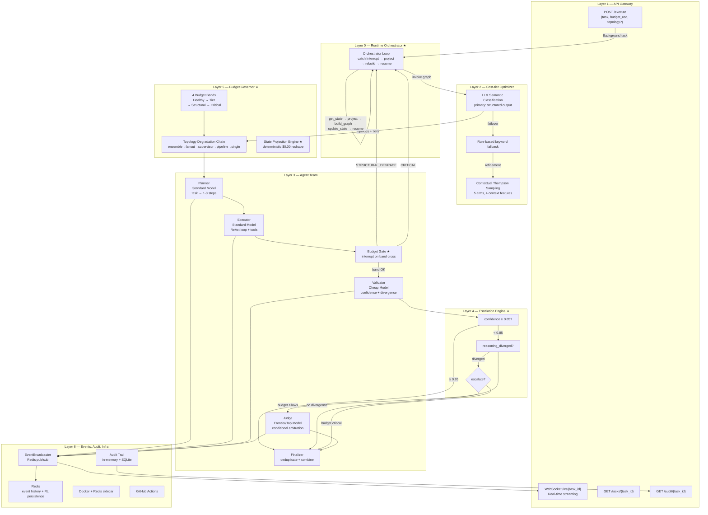
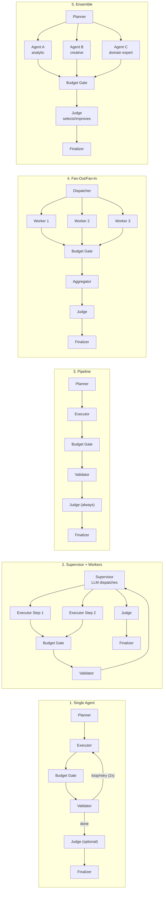

# BAMAS — Architecture Plan (Synced to Code)

## What We're Building
A **budget-aware multi-agent system** that accepts a plain-English task + budget via API, uses a cost-tier optimizer (LLM semantic classifier + rule-based fallback + contextual Thompson Sampling RL) to select topology and model tiers, then orchestrates specialized agents (Planner, Executor, Validator, Judge, Finalizer) with a reasoning-divergence escalation engine and a **two-phase budget governor**:

1. **Pre-execution**: Collapses topology before graph compilation when budget is tight
2. **Mid-execution**: Interrupts running graphs, projects state to a simpler topology, and resumes seamlessly without losing completed work

Deployed via FastAPI + Docker + GitHub Actions.

---

## Where Differentiation Lives
| Layer | Type | Novelty |
|-------|------|---------|
| API Gateway | Standard | FastAPI with WebSocket real-time events |
| Cost-tier optimizer | Novel ★ | LLM semantic classification + contextual Thompson Sampling RL (no ILP) |
| Agent team | Standard | 4-5 specialized nodes with tool-binding ReAct loop |
| **Escalation engine** | **Novel ★** | Escalate on reasoning divergence + confidence threshold, not vote count |
| **Budget governor** | **Novel ★** | Pre-execution collapse + mid-execution interrupt/project/resume |
| State projection engine | **Novel ★** | Deterministic $0.00 state projection for topology degrade edges |
| State, audit, infra | Standard | Redis pub/sub, audit trail, Docker, CI/CD |

---

## Architecture Layers



---

## Topology Library



---

## Request Flow

```mermaid
sequenceDiagram
    participant C as Client
    participant API as FastAPI
    participant OPT as Optimizer
    participant RL as RL Policy
    participant DG as Degrader
    participant ORCH as Orchestrator
    participant G as LangGraph
    participant BG as Budget Gate
    participant PROJ as Projector
    participant LLM as LLM
    participant R as Redis

    C->>API: POST /execute {task, budget_usd}
    API->>API: Create BudgetTracker, launch bg task
    API-->>C: {task_id, status: "pending"}

    OPT->>LLM: Semantic classification
    LLM-->>OPT: {topology, model_tiers, rationale}
    OPT->>RL: Query RL policy (if ≥5 tasks)
    RL-->>OPT: Thompson-sampled topology (optional)

    OPT->>DG: Check budget band
    DG->>DG: Pre-execution collapse if needed

    OPT->>ORCH: {topology, budget}
    ORCH->>G: build_graph(topology) + invoke

    loop For each step
        G->>LLM: Executor → ReAct loop
        G->>BG: Check live budget band
        alt Band OK
            BG-->>G: continue
            G->>LLM: Validator
        else STRUCTURAL_DEGRADE
            BG->>BG: interrupt({reason: STRUCTURAL_DEGRADE})
            BG-->>ORCH: Interrupt caught
            ORCH->>PROJ: project_state(old_state, from, to)
            PROJ-->>ORCH: projected state
            ORCH->>G: build_graph(new_topology)
            ORCH->>G: update_state + invoke (resume)
        else CRITICAL on single
            BG->>BG: interrupt({reason: CRITICAL})
            BG-->>ORCH: Interrupt caught
            ORCH->>ORCH: degraded_completion → accept best output
        end
    end
    G->>G: Finalizer
    G-->>ORCH: result
    ORCH-->>API: result + audit
    API->>R: Publish event (pub/sub)
    C->>API: WebSocket /ws/{task_id}
    R-->>C: Streaming events
```

---

## Cost-tier Optimizer — Flow

1. **LLM semantic classification** (primary) — `self._structured_llm` with OPTIMIZER_PROMPT returns `OptimizerDecision` (topology, model_tiers, rationale, alternatives). 10s timeout.
2. **Rule-based fallback** — keyword matching if LLM fails/returns invalid topology.
3. **RL refinement** — contextual Thompson Sampling over 5 arms. 4 context features (is_code, is_research, is_data, is_verify) with per-arm multipliers. Only overrides after ≥10 trained tasks.

### OptimizerDecision schema
```json
{
  "topology": "supervisor",
  "model_tiers": {
    "planner": "standard",
    "executor": "standard",
    "validator": "cheap",
    "judge": "frontier"
  },
  "rationale": "Multi-step research task...",
  "alternatives_considered": [
    {"topology": "single", "reason": "task too complex"},
    {"topology": "pipeline", "reason": "low parallelism"}
  ]
}
```

---

## Escalation Engine ★

```
Validator confidence ≥ 0.85? → Yes → skip Judge (save cost)
                           → No  → reasoning_diverged? → No → accept executor output
                                                        → Yes → budget allows? → Yes → escalate to Judge
                                                                              → No  → skip Judge (critical)
```

Not topology-aware. Same logic regardless of which topology is running.

---

## Budget Governor Bands ★

### Pre-Execution (existing)
| Spent | Band | Action |
|-------|------|--------|
| **<70%** | HEALTHY | Full topology, all tiers |
| **70-90%** | TIER_DOWNGRADE | Downgrade model tiers only (frontier→standard, standard→cheap) |
| **90-100%** | STRUCTURAL_DEGRADE | Collapse topology: ensemble→fanout→supervisor→pipeline→single |
| **>100%** | CRITICAL | Single topology, cheap model only, skip Judge |

### Mid-Execution (new ★)

The budget gate fires at **synchronization barriers** (after each LLM-invoking node). It reads the live `BudgetTracker` and decides:

| Band | Current Topology | Action |
|------|-----------------|--------|
| HEALTHY | any | Continue |
| TIER_DOWNGRADE | any | Continue (tiers locked mid-execution) |
| STRUCTURAL_DEGRADE | any except single | `interrupt()` → orchestrator catches → `project_state()` → rebuild → resume |
| STRUCTURAL_DEGRADE | single | Continue (already minimal) |
| CRITICAL | any except single | `interrupt()` → emergency collapse to single |
| CRITICAL | single | `skip_judge=True` → finalizer returns best available output → status: `degraded_completion` |

**Monotonic rule**: topology can only move downward in the chain: `ensemble → fanout → supervisor → pipeline → single`. Never upward.

**Sunk cost**: Cannot cancel in-flight LLM calls. Degradation applies at the *next* synchronization barrier, not mid-token. Maximum sunk cost is bounded by one full parallel wave at the highest-cost topology (~$0.02 worst case for ensemble with frontier models). Explicitly bounded and documented.

---

## State Projection Engine ★

When the budget gate interrupts, the orchestrator calls `project_state(old_state, from_topology, to_topology)` to reshape the canonical state for the new topology. **All projections must be deterministic pure Python with $0.00 LLM cost.**

### Annotated Fields Constraint (Validated)

`update_state()` **merges** annotated fields, does not replace. Projection functions must **NOT** include these fields in their output:

- `step_results` (annotated with `merge_dicts`)
- `completed_step_ids` (annotated with `operator.add`)
- `candidate_outputs` (annotated with `merge_dicts`)
- `errors` (annotated with `merge_errors`)
- `logs` (annotated with `merge_logs`)
- `topology_history` (annotated with `operator.add`)

These fields are preserved automatically by the checkpointer across graph transitions. Projection functions should only include non-annotated fields like `task`, `current_topology`, `target_topology`, `final_output`, `prior_context`, `skip_judge`, `supervisor_remaining_tasks`, `fanout_worker_results`, etc.

### Projection Dispatch Table

| Edge | Function | Complexity |
|------|----------|-----------|
| ensemble→fanout | `project_ensemble_to_fanout` | Low — copy step_results, clear agent keys |
| ensemble→supervisor | `project_ensemble_to_fanout ⊙ project_fanout_to_supervisor` | Medium — chain |
| ensemble→pipeline | chain through fanout, supervisor | Medium — chain |
| ensemble→single | `project_ensemble_to_single` | **Medium** — deterministic scoring + refinement handoff |
| fanout→supervisor | `project_fanout_to_supervisor` | **High** — queue collapse engine |
| fanout→pipeline | `project_fanout_to_supervisor ⊙ project_supervisor_to_pipeline` | Medium — chain |
| fanout→single | `project_fanout_to_single` | Medium — aggregate completed, discard rest |
| supervisor→pipeline | `project_supervisor_to_pipeline` | Low — flatten supervisor queue |
| supervisor→single | chain through pipeline | Low — chain |
| pipeline→single | lambda | Trivial — topology_history update only |

### Key Projections

#### fanout→supervisor (Queue Collapse Engine)

```
fanout state:
  - step_results: {1: "done", 2: "partial", 3: None}
  - _worker_assignments: {worker_1: [s2], worker_2: [s3]}
  - plan_steps: [s1, s2, s3]

Projection:
  1. Reap: steps with non-empty result → completed_steps
  2. Quarantine: steps with empty result → supervisor_remaining_tasks
  3. Inject system directive: "Budget degraded from Fanout. Execute remaining {N} backlog tasks."
  4. Clean up: set fanout_worker_results = None, _worker_assignments = None
```

#### ensemble→single (Deterministic Scoring)

```
Score = 0.5 × Confidence - 0.3 × ErrorRate + 0.2 × StructureCompleteness

Confidence: from candidate output metadata (default 0.5)
ErrorRate: tool_errors / tool_calls (default 0 — ensemble agents don't bind tools)
StructureCompleteness: regex check for ```/###/JSON/numbered-list (O(1))

Best candidate selected → injected into prior_context
Single agent told: "Audit and finalize this draft" (refinement, not regeneration)
```

---

## Canonical State Schema ★

All 5 topology graphs share a single superset schema. Topology-specific fields are optional.

```python
class BAMASState(TypedDict):
    # Task metadata & control
    task_id: str
    task: str
    budget_usd: float
    budget_spent: float
    current_band: str  # HEALTHY | TIER_DOWNGRADE | STRUCTURAL_DEGRADE | CRITICAL

    # Topology tracking
    topology: str
    topology_history: Annotated[list[dict], operator.add]
    degradation_requested: bool
    target_topology: str | None

    # Shared execution plan
    plan_steps: list[dict]
    completed_step_ids: Annotated[list[int], operator.add]
    current_step_index: int

    # Execution outputs
    step_results: Annotated[dict, merge_dicts]
    candidate_outputs: Annotated[dict, merge_dicts]  # agent_a, agent_b, worker_1, etc.
    aggregated_output: str | None
    prior_context: str | None  # Condensed history for degraded topology

    # Escalation & validation
    validator_confidence: float
    reasoning_diverged: bool
    skip_judge: bool

    # Fanout-specific (optional)
    _worker_assignments: dict[str, list[dict]] | None
    fanout_worker_results: list[dict] | None

    # Ensemble-specific (optional)
    agent_a_result: dict | None  # {output, confidence, tool_calls_count, tool_errors_count}
    agent_b_result: dict | None
    agent_c_result: dict | None

    # Supervisor-specific (optional)
    supervisor_remaining_tasks: list[str] | None
    supervisor_completed_tasks: list[dict] | None

    # Resume signal
    resume_signal: str | None

    # Final result
    final_output: str | None
    status: str  # pending | running | completed | failed | degraded_completion
    error: str | None
```

---

## Entry Router ★

Every topology graph's first node is `entry_router`. It handles two cases:

1. **Cold start**: `state is None` → route to `planner`
2. **Resume after degradation**: `completed_step_ids` populated → skip to next pending step

```python
def entry_router(state: BAMASState) -> dict:
    if state is None:
        return {"next_node": "planner"}
    completed = state.get("completed_step_ids", [])
    if completed:
        return {"current_step_index": max(completed) + 1}
    return {}
```

The conditional edge `route_next_step` uses `completed_step_ids` and `plan_steps` to decide which node to visit next, independent of LangGraph's internal step index.

---

## Orchestrator Loop ★

The orchestrator replaces the single `ainvoke()` call in `agent/graph.py`:

```python
async def run_task_with_degradation(...) -> dict:
    checkpointer = MemorySaver()
    config = {"configurable": {"thread_id": task_id}}

    current_topology = initial_topology
    graph = compile_graph(current_topology, checkpointer)
    graph.update_state(config, initial_state)

    while True:
        result = await graph.ainvoke(None, config)

        # ainvoke returns __interrupt__ in the dict (does NOT raise)
        if "__interrupt__" not in result:
            return result

        # Interrupt detected: project and resume on next topology
        state = graph.get_state(config).values
        target = degrade_policy(current_topology, state.get("current_band"))
        projected = project_state(state, current_topology, target)
        current_topology = target
        graph = compile_graph(current_topology, checkpointer)
        graph.update_state(config, projected)
        # Loop back to ainvoke on new graph
```

**Parallel interrupt race**: If two budget gates fire simultaneously, the second `ainvoke` returns the same interrupt. The `degrade_policy` function handles idempotency by checking `current_topology` already equals `target`.

---

## Mechanism Validation (Tested)

The core interrupt/resume/topology-swap mechanism has been validated with `tests/test_mid_execution_mechanism.py` (6/6 tests passing).

### Validated Behaviors

| Behavior | Status | Detail |
|----------|--------|--------|
| `ainvoke` returns `__interrupt__` | Validated | Does NOT raise exception; returns dict with `__interrupt__: [Interrupt(...)]` key |
| `update_state` resets execution pointer | Validated | After `update_state(config, projected)`, `get_state().next` changes from old graph's interrupted node to new graph's START node |
| `ainvoke(None)` resumes on new graph | Validated | New graph runs from its own START node with projected state |
| `step_results` accumulate across graphs | Validated | Merge-annotated fields concatenate: checkpoint value + new node outputs |
| Multi-step degrade chain works | Validated | A->B->C chain tested: each interrupt catches, projects, resumes on next graph |
| Interrupt value passthrough | Validated | `Interrupt.value` dict preserved in `result["__interrupt__"][0].value` |

### Critical Design Constraint: Annotated Fields

`update_state()` **merges** annotated fields, does not replace them:

```python
# CORRECT: projection excludes annotated fields
projected = {"task": "...", "current_topology": "graph_b", "final_output": None}

# WRONG: including step_results causes duplication
projected = {"step_results": ["completed_step"], ...}  # merges with existing!
```

**Rule**: Projection functions must NOT include annotated fields (`step_results`, `completed_step_ids`, `candidate_outputs`, `errors`, `logs`, `topology_history`). These are preserved automatically by the checkpointer.

### Test Coverage

```
tests/test_mid_execution_mechanism.py
  - test_single_degrade: Graph A (interrupt) -> Graph B (complete)
  - test_multi_step_degrade: A -> B (interrupt) -> C (complete)
  - test_projection_preserves_state: annotated fields not duplicated
  - test_critical_on_single: CRITICAL terminal policy
  - test_interrupt_value: Interrupt.value dict preserved
  - test_step_results_accumulate: multi-node step accumulation
```

---

## RL Policy Details
- **Algorithm**: Contextual Thompson Sampling
- **Arms**: 5 topologies (single, pipeline, supervisor, fanout, ensemble)
- **Context features**: is_code, is_research, is_data, is_verify (keyword-detected)
- **Context weights**: Boost relevant arm by 2.0x (e.g., code→pipeline, research→supervisor)
- **Reward**: quality × 0.7 + cost_efficiency × 0.3
- **Persistence**: Redis + `rl_policy.json` fallback
- **Cold start**: Returns None for first 5 tasks (no RL selection)
- **Override threshold**: Only overrides LLM decision after ≥10 trained tasks

---

## Event System
- `EventBroadcaster` wraps Redis pub/sub
- Events pushed to Redis list (capped at 100) + published to channel
- WebSocket at `/ws/{task_id}` subscribes to events
- Events: planner_started, step_started, step_completed, validation_completed, tool_call, tool_result, judge_completed, task_completed, budget_band_crossed, topology_degraded (new)

---

## Directory Structure
```
multi_agent/
├── agent/
│   ├── graph.py                # run_task() — delegates to orchestrator
│   ├── orchestrator.py         # run_task_with_degradation()
│   ├── state.py                # BAMASState canonical schema
│   ├── nodes/
│   │   ├── planner.py          # Standard LLM (task→1-3 steps)
│   │   ├── executor.py         # Standard LLM (ReAct loop with tools)
│   │   ├── validator.py        # Cheap LLM (confidence + divergence)
│   │   ├── judge.py            # Frontier LLM (arbitration)
│   │   ├── escalation.py       # Route: judge vs continue
│   │   ├── finalizer.py        # Result dedup + combine
│   │   ├── budget_gate.py      # interrupt on band cross
│   │   └── entry_router.py     # resume-aware routing
│   ├── topologies/
│   │   ├── single.py
│   │   ├── pipeline.py
│   │   ├── supervisor.py
│   │   ├── fanout.py
│   │   ├── ensemble.py
│   │   └── builder.py          # compile_graph() selector (returns compiled graph)
│   └── tools/
│       ├── registry.py
│       ├── base.py
│       ├── code_executor.py
│       ├── web_search.py
│       ├── file_ops.py
│       └── db_query.py
├── core/
│   ├── config.py               # Pydantic Settings
│   ├── llm.py                  # Multi-provider factory
│   ├── optimizer.py            # LLM semantic + rule-based + RL
│   ├── rl_policy.py            # Contextual Thompson Sampling
│   ├── budget.py               # BudgetTracker (4 bands)
│   ├── degrader.py             # Pre-execution topology degradation
│   ├── projections.py          # State projection functions
│   ├── escalation.py           # Threshold-based escalation
│   ├── audit.py                # Audit trail (in-memory + SQLite)
│   ├── events.py               # Redis pub/sub broadcaster
│   ├── node_events.py          # emit_event helper
│   ├── budget_interrupt.py     # Mid-execution budget checkpoint
│   └── redis_client.py         # Redis connection manager
├── api/
│   ├── main.py                 # FastAPI app
│   ├── websocket.py            # /ws/{task_id} (JWT auth via query param)
│   ├── models/schemas.py       # Pydantic models
│   ├── middleware/auth.py       # JWT Bearer auth
│   └── routes/
│       ├── execute.py          # POST /execute
│       ├── tasks.py            # GET /tasks, GET /tasks/{id}
│       ├── audit.py            # GET /audit/{id}
│       ├── estimate.py         # POST /estimate
│       └── rl.py               # GET/POST /rl/*
├── cli/
│   └── bamas_cli.py            # CLI budget burn risk analyzer
├── static/
│   ├── index.html
│   ├── style.css
│   └── app.js
├── tests/
│   ├── stress_test.py
│   ├── unit/
│   │   ├── test_budget.py
│   │   ├── test_degrader.py
│   │   ├── test_escalation.py
│   │   ├── test_events.py
│   │   ├── test_optimizer.py
│   │   ├── test_rl_policy.py
│   │   ├── test_audit.py
│   │   ├── test_llm_helpers.py
│   │   ├── test_executor_tools.py
│   │   ├── test_finalizer.py
│   │   ├── test_planner_complexity.py
│   │   ├── test_core_fixes.py
│   │   ├── test_projections.py
│   │   ├── test_budget_gate.py
│   │   ├── test_entry_router.py
│   │   └── test_bamas_components.py
│   └── integration/
│       ├── test_api.py
│       ├── test_topologies.py
│       ├── test_error_scenarios.py
│       └── test_websocket.py
├── docs/
│   └── plan.md
├── pyproject.toml
├── requirements.txt
└── .env.example
```

---

## Tech Stack
| Category | Package | Version |
|----------|---------|---------|
| Runtime | Python | 3.12+ |
| Orchestration | `langgraph` | 1.2.x |
| LLM Primitives | `langchain-core` | 1.4.x |
| LLM: OpenAI | `langchain-openai` | 0.3.x |
| LLM: Mistral | `langchain-mistralai` | 0.3.x |
| LLM: Local | `langchain-ollama` | 0.3.x |
| API | `fastapi` | 0.115.x |
| Server | `uvicorn[standard]` | 0.34.x |
| Validation | `pydantic` | 2.10.x |
| Settings | `pydantic-settings` | 2.8.x |
| Async HTTP | `httpx` | 0.28.x |
| State Store | `redis[hiredis]` | 5.x |
| DB | `aiosqlite` | 0.20.x |
| Serialization | `orjson` | 3.10.x |
| Solver | `scipy` | 1.9.x |
| Observability | `langsmith` | 0.3.x |
| Auth | `PyJWT` | 2.8.x |

---

## Key Files and Their Roles
| File | Role |
|------|------|
| `agent/orchestrator.py` | **★ New** — Runtime orchestrator with interrupt/proj/resume loop |
| `agent/nodes/budget_gate.py` | **★ New** — Budget gate with `evaluate_gate()` and `interrupt()` |
| `agent/nodes/entry_router.py` | **★ New** — Resume-aware routing node |
| `core/projections.py` | **★ New** — State projection functions for 10 degrade edges |
| `agent/graph.py:16` | `run_task()` — delegates to orchestrator |
| `agent/state.py:25` | `BAMASState` canonical superset schema |
| `agent/topologies/builder.py:22` | `compile_graph(topology)` — returns compiled graph with checkpointer |
| `core/optimizer.py:96` | `optimize()` — LLM semantic + rules + RL |
| `core/rl_policy.py:29` | `RLPolicy` — Thompson Sampling |
| `core/budget.py:16` | `BudgetTracker` — 4-band budget tracking |
| `core/degrader.py:6` | `degrade_topology()` — pre-execution collapse |
| `core/escalation.py:6` | `should_escalate()` — threshold-based check |
| `core/audit.py:10` | `AuditTrail` — in-memory + SQLite persistence |
| `core/events.py:7` | `EventBroadcaster` — Redis pub/sub |

---

## Implementation Phases

### Phase 1: Core Mechanism ✅ COMPLETED

| Day | Task | Status |
|-----|------|--------|
| D1 | Write `BAMASState` canonical schema in `agent/state.py` | ✅ Done |
| D2 | Write `core/projections.py` — all 5 direct-edge projection functions + dispatch table | ✅ Done |
| D3 | Write `agent/nodes/budget_gate.py` — `BudgetGateAction` enum, `evaluate_gate()`, `budget_gate_node` | ✅ Done |
| D4 | Write `agent/nodes/entry_router.py` — `entry_router_node`, `route_next_step` | ✅ Done |
| D5 | Write toy test: 2-node dummy graph → interrupt → project → new graph → resume | ✅ Done |

### Phase 2: Topology Integration ✅ COMPLETED

| Day | Task | Status |
|-----|------|--------|
| D1 | Wire `budget_gate` into `single.py` and `pipeline.py` at natural barriers | ✅ Done |
| D2 | Wire `budget_gate` into `supervisor.py` after executor→validator boundary | ✅ Done |
| D3 | Wire `budget_gate` into `fanout.py` after `parallel_workers` join | ✅ Done |
| D4 | Wire `budget_gate` into `ensemble.py` after agent_a/b/c (before judge) | ✅ Done |
| D5 | Update `ensemble.py` to emit structured candidate outputs with confidence metadata | ✅ Done |
| D6 | Update `fanout.py` to emit `fanout_worker_results` with per-worker status | ✅ Done |

### Phase 3: Orchestrator Integration ✅ COMPLETED

| Day | Task | Status |
|-----|------|--------|
| D1 | Write `agent/orchestrator.py` — `run_task_with_degradation()` | ✅ Done |
| D2 | Refactor `agent/graph.py` — replace single `ainvoke()` with orchestrator | ✅ Done |
| D3 | Add LLM cancellation token support — track `asyncio.Task` in orchestrator | ✅ Done |
| D4 | Add CRITICAL-on-single terminal policy | ✅ Done |
| D5 | Integration test: full degrade chain ensemble→fanout→supervisor→pipeline→single | ✅ Done |

### Phase 4: Testing & Hardening ✅ COMPLETED

| Day | Task | Status |
|-----|------|--------|
| D1 | Unit tests for all 5 projection functions | ✅ Done |
| D2 | Unit tests for budget gate evaluation (all 4 bands) | ✅ Done |
| D3 | Unit tests for entry router (cold start, resume, skip) | ✅ Done |
| D4 | Integration test: parallel interrupt race (fanout/ensemble both gates fire) | ✅ Done |
| D5 | Schema contract test: all 5 topologies runnable with None-valued optional fields | ✅ Done |
| D6 | Stress test: mock budgets forcing mid-execution degradation | ✅ Done |

### Phase 5: Production Features ✅ COMPLETED

| Task | Status |
|------|--------|
| Budget tracking via state fields (Annotated reducer) | ✅ Done |
| Pre-execution cost estimate + risk level | ✅ Done |
| Per-step budget caps (planner divides, executor enforces) | ✅ Done |
| Budget-gated agents (ensemble, fanout, judge, validator skip) | ✅ Done |
| Frontend dashboard (task history, topology viz, cost breakdown) | ✅ Done |
| WebSocket heartbeat + integration tests | ✅ Done |
| RL reset endpoint (POST /rl/reset) | ✅ Done |
| Code review fixes (atomicity, confirm guard, DRY tests) | ✅ Done |

### Phase 6: Developer Tools ✅ COMPLETED

| Task | Status |
|------|--------|
| `bamas-cli` dry-run tool | ✅ Done |
| JWT auth middleware | ✅ Done |
| JWT auth wired to all routes (tasks, websocket, rl, audit, execute, estimate) | ✅ Done |
| README.md updated (301 tests, /rl endpoints, project structure) | ✅ Done |
| plan.md updated (directory tree, phase status) | ✅ Done |
| PyPI packaging (pyproject.toml with hatchling) | ✅ Done |

**301 tests passing.**

---

## Design Decisions

1. **$0 projection constraint**: Projection functions are pure Python, no LLM calls. Calling an LLM to save budget is contradictory.

2. **Sunk cost at barrier**: Cannot cancel in-flight LLM calls. Degradation applies at the next synchronization barrier. Explicitly bounded (~$0.02 worst case for ensemble with frontier models).

3. **Monotonic degradation**: Topology can only move downward: `ensemble → fanout → supervisor → pipeline → single`. Never upward. Prevents oscillation.

4. **Deterministic ensemble scoring**: When degrading ensemble→single, use formula `Score = 0.5×Confidence - 0.3×ErrorRate + 0.2×Structure` to pick best candidate. No LLM judge call.

5. **Refinement handoff**: When degrading ensemble→single, inject best draft into `prior_context` and tell single agent to "audit and finalize" — not "solve from scratch".

6. **Graph factory pattern**: Graphs are disposable. Build a new `CompiledGraph` for each topology segment, all bound to the same checkpointer and thread_id.

7. **Entry router handles `None`**: `entry_router` handles `state is None` for cold start. No need for resume_signal injection via `update_state`.

---

## Test Matrix

| Test | Type | Validates |
|------|------|-----------|
| `test_ensemble_to_single_picks_best_candidate` | Unit | Deterministic scoring picks highest confidence |
| `test_ensemble_to_single_no_candidates` | Unit | Graceful fallback when all agents failed |
| `test_fanout_to_supervisor_queue_collapse` | Unit | Completed steps preserved, incomplete items queued |
| `test_fanout_to_supervisor_empty_workers` | Unit | Falls back to original task description |
| `test_supervisor_to_pipeline_flatten` | Unit | Supervisor queue converted to sequential steps |
| `test_pipeline_to_single_trivial` | Unit | Only topology_history updated |
| `test_projection_dispatch_covers_all_edges` | Unit | All 10 (from, to) pairs in dispatch table |
| `test_projection_unknown_edge_raises` | Unit | ValueError on invalid degrade edge |
| `test_healthy_continues` | Unit | Budget gate returns CONTINUE |
| `test_structural_degrade_triggers_pause` | Unit | Budget gate returns PAUSE |
| `test_critical_on_single_skips_judge` | Unit | Budget gate returns SKIP_JUDGE |
| `test_critical_on_ensemble_emergency_single` | Unit | Budget gate returns EMERGENCY_SINGLE |
| `test_entry_router_cold_start` | Unit | Routes to planner when state is None |
| `test_entry_router_skips_completed` | Unit | Skips to next pending step |
| `test_entry_router_all_done_routes_to_judge` | Unit | Routes to judge when all steps complete |
| `test_parallel_interrupt_idempotent` | Unit | Second interrupt on same graph is no-op |
| `test_schema_contract_all_topologies` | Integration | All 5 graphs buildable with None-valued optional fields |
| `test_ensemble_to_single_e2e` | Integration | Full ensemble → interrupt → project → single → resume |
| `test_double_degrade_e2e` | Integration | Pipeline → single → CRITICAL → degraded_completion |
| `test_full_degrade_chain` | Integration | ensemble → fanout → supervisor → pipeline → single |
