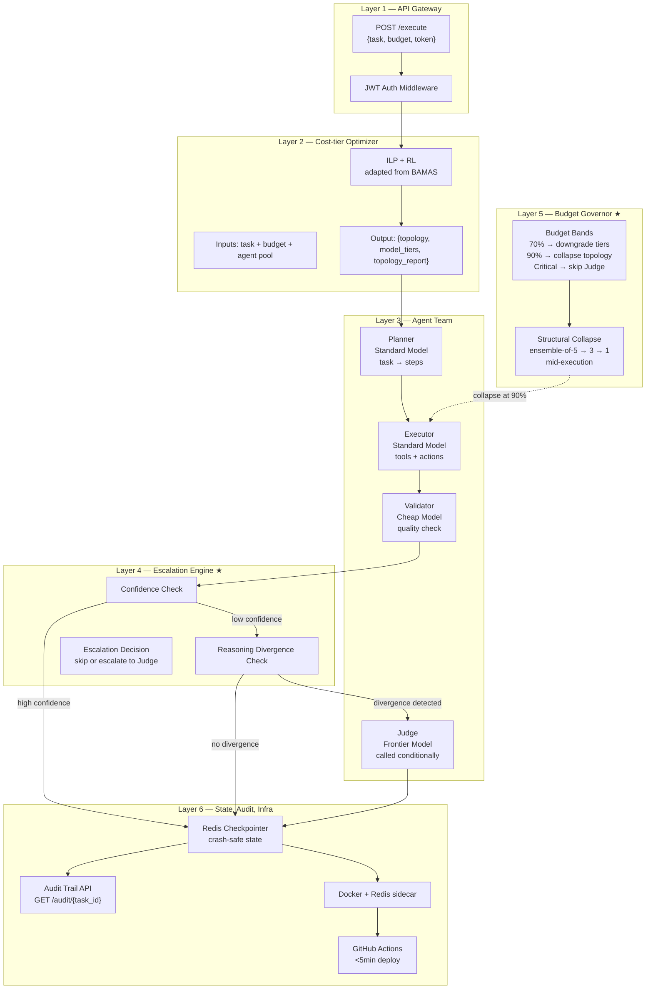
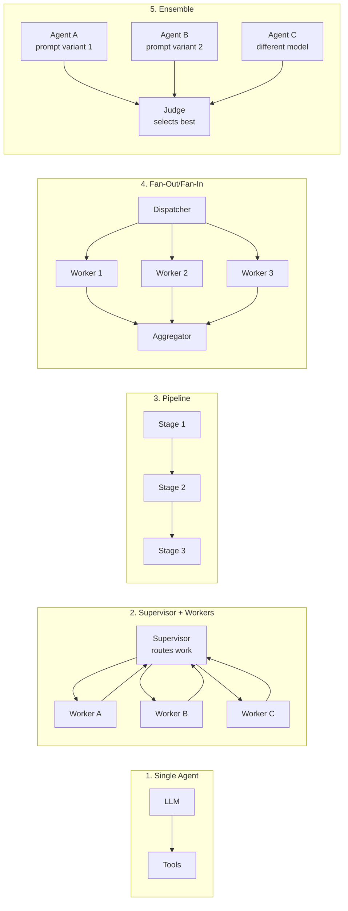
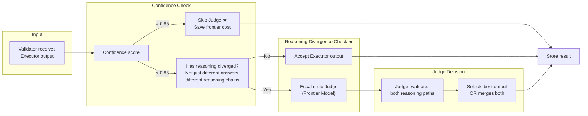

# Multi-Agent Task Executor — Architecture Plan

## What We're Building

A **budget-aware multi-agent system** that accepts a plain-English task + budget via API, uses a cost-tier optimizer (ILP+RL, adapted from BAMAS) to select topology and model tiers, then orchestrates four specialized agents (Planner, Executor, Validator, Judge) with a standalone escalation engine that triggers on reasoning divergence, and a budget governor that collapses topology mid-execution when cost runs low. Deployed via FastAPI + Docker + GitHub Actions in sub-5-minute CI/CD cycles.

## Where Differentiation Lives

| Layer | Type | Novelty |
|-------|------|---------|
| API Gateway | Standard | Adopted from commodity FastAPI |
| Cost-tier optimizer | Standard | ILP+RL, adapted from BAMAS (AAAI 2026) |
| Agent team | Standard | Standard agent decomposition |
| **Escalation engine** | **Novel ★** | Escalate on reasoning divergence, not vote count |
| **Budget governor** | **Novel ★** | Mid-task structural collapse, not just model swapping |
| State, audit, infra | Standard | Redis, audit log, CI/CD, adopted from research |

---

## Architecture Layers



---

## Topology Library



---

## Escalation Engine ★ (Layer 4)



---

## Cost-tier Optimizer — Structured Output

```json
{
  "topology": "supervisor",
  "model_tiers": {
    "planner": "standard",
    "executor": "standard",
    "validator": "cheap",
    "judge": "conditional_frontier"
  },
  "audit_entry": {
    "task_summary": "Research and draft report on quantum computing trends",
    "budget_at_decision": 1.00,
    "rationale": "Complex multi-step research task with branching subtopics. Supervisor topology allows dynamic delegation to specialist workers. Standard models sufficient for planning and execution; validator can use cheap model. Judge reserved for final quality arbitration if disagreement arises.",
    "alternatives_considered": [
      {"topology": "single", "rejected_reason": "task too complex for single agent (complexity=7/10)"},
      {"topology": "pipeline", "rejected_reason": "low parallelism potential (score=0.3)"}
    ]
  }
}
```

---

## Budget Governor Bands ★ (Layer 5)

| Spent | Budget Remaining | Action |
|-------|-----------------|--------|
| **<70%** | >30% | Full topology, all tiers. Normal operation. |
| **70-90%** | 10-30% | Downgrade model tiers only (frontier → standard, standard → cheap). Topology unchanged. |
| **90%+** | <10% | Collapse topology mid-execution. Ensemble-of-5 → ensemble-of-3 → single pipeline. Re-route through optimizer with degraded budget. |
| **Critical** | ~0% | Skip Judge entirely. Return best available result immediately. |

---

## Build Plan

### V1 — Weeks (Demo-Ready)

| Module | Files | Key Logic |
|--------|-------|-----------|
| **Cost-tier Optimizer** | `core/optimizer.py`, `core/budget.py` | ILP + RL topology/model selection adapted from BAMAS |
| **Agent Team** | `agent/nodes/planner.py`, `executor.py`, `validator.py`, `judge.py` | 4 specialized agents |
| **Topology Templates** | `agent/topologies/single.py`, `supervisor.py`, `pipeline.py`, `fanout.py`, `ensemble.py` | 5 static graph builders |
| **Audit Trail** | `api/routes/audit.py`, `core/audit.py` | Every decision logged, exposed via GET /audit/{id} |
| **API + Infra** | `api/main.py`, `Dockerfile`, `docker-compose.yml`, `.github/workflows/deploy.yml` | FastAPI, JWT, Redis sidecar, Docker build |

### V2 — Months (Defensible IP)

| Module | Files | Key Logic |
|--------|-------|-----------|
| **Escalation Engine ★** | `agent/nodes/escalation.py`, `core/escalation.py` | Reasoning divergence check, conditional Judge routing |
| **Budget Governor ★** | `core/degrader.py` | Mid-execution topology collapse: 5→3→1 at budget bands |
| **Dynamic Graph Builder** | `agent/topologies/builder.py` | Construct LangGraph at runtime from optimizer output |

### V3 — When Data Exists

| Module | Files | Key Logic |
|--------|-------|-----------|
| **Self-Opt Loop** | `core/learning.py` | Judge scores → improve optimizer decisions over time |
| **Topology Stats DB** | `core/stats.py` | Track which topology × budget × task combo performs best |

---

## Directory Structure

```
multi_agent/
├── agent/
│   ├── __init__.py
│   ├── graph.py                # LangGraph builder
│   ├── state.py                # AgentState TypedDict
│   ├── nodes/
│   │   ├── __init__.py
│   │   ├── planner.py          # Standard model
│   │   ├── executor.py         # Standard model
│   │   ├── validator.py        # Cheap model
│   │   ├── judge.py            # Frontier model (conditional)
│   │   └── escalation.py       # ★ Reasoning divergence check
│   ├── topologies/
│   │   ├── __init__.py
│   │   ├── single.py
│   │   ├── supervisor.py
│   │   ├── pipeline.py
│   │   ├── fanout.py
│   │   ├── ensemble.py
│   │   └── builder.py          # ★ Dynamic graph constructor (V2)
│   └── tools/
│       ├── __init__.py
│       ├── registry.py
│       ├── base.py
│       ├── code_executor.py
│       ├── web_search.py
│       ├── file_ops.py
│       └── db_query.py
├── core/
│   ├── __init__.py
│   ├── config.py               # Pydantic Settings
│   ├── llm.py                  # Multi-provider factory
│   ├── optimizer.py            # Cost-tier optimizer (BAMAS-adapted)
│   ├── escalation.py           # ★ Escalation engine (V2)
│   ├── budget.py               # Budget tracker
│   ├── degrader.py             # ★ Budget governor: structural collapse (V2)
│   ├── audit.py                # Audit trail
│   ├── learning.py             # Self-optimization loop (V3)
│   └── stats.py                # Topology performance stats (V3)
├── api/
│   ├── __init__.py
│   ├── main.py                 # FastAPI app
│   ├── routes/
│   │   ├── __init__.py
│   │   ├── execute.py          # POST /execute
│   │   ├── tasks.py            # GET /tasks/{id}
│   │   └── audit.py            # ★ GET /audit/{id}
│   ├── models/
│   │   ├── __init__.py
│   │   └── schemas.py
│   └── websocket.py
├── tests/
│   ├── __init__.py
│   ├── unit/
│   ├── integration/
│   └── fixtures/
├── Dockerfile
├── docker-compose.yml
├── requirements.txt
├── requirements-dev.txt
├── pyproject.toml
├── .env.example
├── .gitignore
├── .dockerignore
└── .github/workflows/deploy.yml
```

---

## Tech Stack

| Category | Package | Version |
|----------|---------|---------|
| Runtime | Python | 3.12+ |
| Orchestration | `langgraph` | 1.2.x |
| LLM Primitives | `langchain-core` | 1.4.x |
| LLM: OpenAI | `langchain-openai` | 0.3.x |
| LLM: Anthropic | `langchain-anthropic` | 0.3.x |
| LLM: Local | `langchain-ollama` | 0.3.x |
| ILP Solver | `scipy.optimize` | built-in |
| API | `fastapi` | 0.115.x |
| Server | `uvicorn[standard]` | 0.34.x |
| Validation | `pydantic` | 2.10.x |
| Settings | `pydantic-settings` | 2.8.x |
| Async HTTP | `httpx` | 0.28.x |
| State Store | `redis` | 5.x |
| DB | `aiosqlite` | 0.20.x |
| Serialization | `orjson` | 3.10.x |
| Observability | `langsmith` | 0.3.x |
| Linter | `ruff` | 0.12.x |
| Type Checker | `mypy` | 1.14.x |
| Test | `pytest` | 8.3.x |

---

## ATS-Optimized Bullet Points

> **Multi-Agent Task Executor** — Python, LangGraph, LangChain, FastAPI, Docker, GitHub Actions
>
> - Built a cost-tier optimizer using ILP + reinforcement learning (adapted from BAMAS, AAAI 2026) that selects agent topology and model tiers under explicit budget constraints, reducing cost by up to 86% vs. fixed-topology baselines
> - Designed a standalone escalation engine that triggers Judge escalation only when agents diverge on reasoning chains — not vote count or confidence thresholds — saving the most expensive frontier model call when Validator confidence is high
> - Implemented a budget governor with mid-task structural collapse that degrades multi-agent topology in real-time (ensemble-of-5 → ensemble-of-3 → single pipeline) as budget depletes, ensuring graceful cost-quality trade-off where model-tier swapping alone is insufficient
> - Deployed via FastAPI on Docker with Redis checkpointing and GitHub Actions CI/CD, achieving sub-5-minute production cycles from code push
